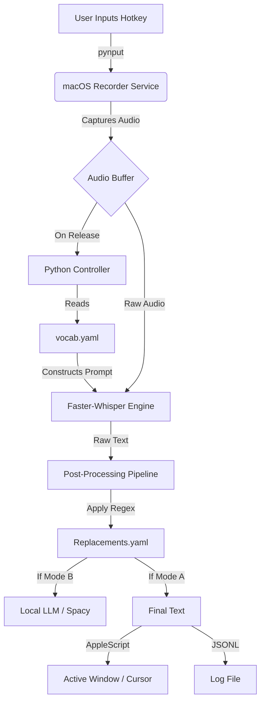

This is a fantastic, well-structured outline. You have correctly identified the biggest pain point with commercial STT (Superwhisper, MacWhisper, etc.): **they prioritize generalized smoothness over personalized accuracy.** They try to be "smart" for everyone, which often makes them "dumb" for a specific user’s niche jargon (e.g., "MNQ," "Runpod," "n8n").

To flesh this out, I will focus on the **Technical Implementation Strategy** (how to actually build the "glue" between macOS and the engine) and the **Personalization Mechanics** (how to force Whisper to listen for *your* words).

Here is a refined technical roadmap to move this from "document" to "deployed tool."

-----

### 1\. The Tech Stack: "Build vs. Buy" Decisions

Based on your requirement for **macOS integration** and **Local-First**, I recommend a **Python-centric architecture** wrapped in a lightweight macOS shell. Swift is native, but Python has the best AI libraries.

  * **Core Engine:** **`faster-whisper`** (Python)
      * *Why:* It uses CTranslate2 under the hood, making it significantly faster than standard OpenAI Whisper on CPU/GPU, but it remains pure Python for easy hacking. It supports the `large-v3` model while staying efficient.
  * **Audio Capture:** **`sounddevice`** + **`numpy`**
      * *Why:* Low latency, raw buffer access.
  * **macOS UI/Menubar:** **`rumps`**
      * *Why:* A simple Python library that creates a native macOS menu bar application (the "Status feedback" you requested in).
  * **Global Hotkeys:** **`pynput`**
      * *Why:* Allows you to listen for `⌥⌘V` even when your script is in the background.
  * **Text Injection:** **`pyautogui`** or **AppleScript**
      * *Why:* AppleScript is safer. `pyautogui` mimics keystrokes (slow), whereas AppleScript can insert text directly into the focused element.

-----

### 2\. The "Erik-Specific" Mechanics (The Secret Sauce)

You mentioned a "Personal Vocabulary" and "Static Rule-Based Mapping". Here is exactly how to implement that so the engine actually respects it.

#### A. The `initial_prompt` Hack (Prevention)

Whisper has a hidden superpower: the `initial_prompt` parameter. It isn't just for context; it biases the model's probabilities.

  * **The Strategy:** Before every transcription request, we read your `custom_terms` YAML file.
  * **The Implementation:** We construct a string like: *"Glossary: MNQ, ES, Runpod, Meshy, Cochise County, TradeZella."*
  * **The Result:** We feed this into the model *as if* it was the previous sentence. Whisper sees "Runpod" in the "history" and is mathematically far more likely to predict "Runpod" again rather than "Run pod" or "Ram part."

#### B. The "Post-Correction" Pipeline (Cure)

This handles your **Mode A (Raw)** vs **Mode B (Light Cleanup)**.

  * **Step 1: Raw Output.** Get text from Whisper.
  * **Step 2: Regex Map.** Iterate through your `replacements` YAML.
      * *Example:* `text = re.sub(r'\bman cue\b', 'MNQ', text, flags=re.IGNORECASE)`
  * **Step 3: Mode Logic.**
      * *If Mode A:* Stop here. Return text.
      * *If Mode B:* Pass through a very fast local LLM (like `Phi-3` or `Mistral-7B` running via Ollama) with a system prompt: *"Fix punctuation and capitalization only. Do not rephrase."*

-----

### 3\. Refined Architecture Diagram

Since you want this to run locally on macOS, we need to decouple the "Listener" from the "Transcriber" to keep the UI snappy.



-----

### 4\. Implementation Details for Phase 1 & 2

You outlined Phase 1 (CLI) and Phase 2 (Hotkey). Here is a suggested file structure to make this modular from day one.

**Project Structure:**

```text
erik-stt/
├── config/
│   ├── settings.yaml       # Hotkeys, model size (medium.en/large-v3)
│   ├── vocab.yaml          # "MNQ", "TradeZella"
│   └── replacements.yaml   # "man cue" -> "MNQ"
├── src/
│   ├── audio_capture.py    # Handles mic input
│   ├── engine.py           # Wraps faster-whisper
│   ├── post_process.py     # Regex and text clean up
│   └── main_menubar.py     # The Rumps app + Hotkey listener
├── logs/
│   └── transcription.jsonl # The training data
└── requirements.txt
```

#### Vital Code Snippet: The "Erik Context" Injection

In `engine.py`, when calling the model:

```python
# Pseudo-code for engine.py
def transcribe(audio_segment, custom_vocab_list):
    # Convert list ["MNQ", "Make.com"] into a prompt string
    prompt_str = "Key terms: " + ", ".join(custom_vocab_list) + "."
    
    segments, info = model.transcribe(
        audio_segment,
        language="en",
        initial_prompt=prompt_str, # <--- THIS IS KEY
        beam_size=5,
        temperature=0.0 # Strict accuracy, no creativity
    )
    return segments
```

-----

### 5\. Addressing Your Risks

  * **Accuracy vs Latency:**
      * *Solution:* Use `distil-whisper` models (e.g., `distil-large-v3`). They are 6x faster than standard large models with \<1% accuracy loss. This makes "Large" model accuracy viable for real-time dictation on Apple Silicon.
  * **"Smart" Hallucinations:**
      * *Solution:* Hardcode `temperature=0` and `condition_on_previous_text=False` in your config. Hallucinations often happen when Whisper tries to look too far back in silence and loops. Disabling condition-on-text prevents the "Thank you for watching" YouTube subtitle hallucinations.

-----

### 6\. Suggested Next Step (Immediate)

You are currently in **Phase 0**. I can generate the **Phase 1 Prototype Script** for you right now.

**Would you like me to write a single Python script (`prototype.py`) that:**

1.  Records audio while you hold the `Spacebar`.
2.  Transcribes it using `faster-whisper`.
3.  Injects a hardcoded list of your jargon (e.g., "TradeZella") into the prompt to prove the concept works?